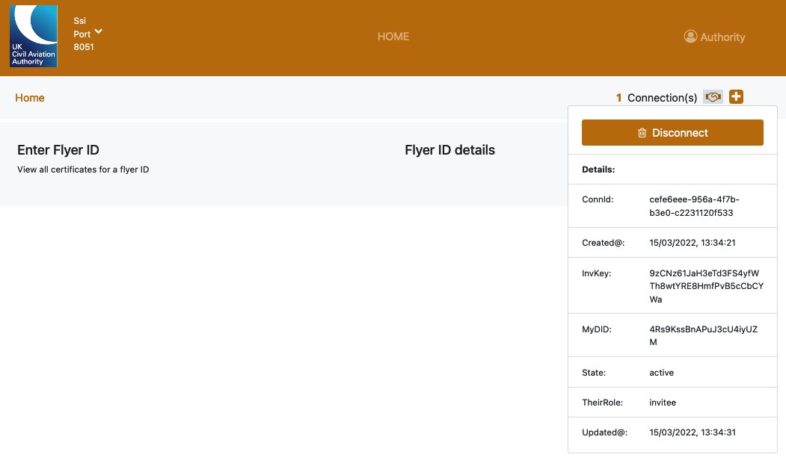

# Veritable Four Agent SSI Demo

Four-agent-based proof of concept SSI system for Veritable.

## Overview

This project is a _four-agent-based_ Self-Sovereign Identity ( _SSI_ ) proof of concept ( _PoC_ ). Each _Agent_ has a distinct role: `Issuer`, `Holder`, `Verifier` and `Authority`. This is similar to the standard [three-agent SSI model](https://en.wikipedia.org/wiki/Self-sovereign_identity#/media/File:Decentralized-identifiers-dids-the-fundamental-building-block-of-selfsovereign-identity-ssi-37-1024_DIDs-enable-digitally-signed-verifiable-claims.jpg), with the addition of a fourth `Authority` role that both issues and verifies credentials.


1. `Issuer` to issue digital credentials.
2. `Holder` to hold cryptographic material in a safe place and countersigns any identity proofs.
3. `Verifier` to send proof requests to the holder and cryptographically verify those proofs, after receiving them.
4. `Authority` to receive proofs from the holder, cryptographically verify those proofs, and then issues further credentials.

|     | The 4 _GUIs_ that can be viewed :        |                                                 |
| :-- | :--------------------------------------- | :---------------------------------------------- |
| #   | **Type & Alias**                         | **Link**                                        |
| 1   | **Issuer** - _Consortiq_ (Pilot Trainer) | [localhost:3000/?#1](http://localhost:3000/?#1) |
| 2   | **Holder** - _Alice_ (Drone Pilot)       | [localhost:3000/?#2](http://localhost:3000/?#2) |
| 3   | **Verifier** - _Airops_ (Airside Ops)    | [localhost:3000/?#3](http://localhost:3000/?#3) |
| 3   | **Authority** - _CAA_                    | [localhost:3004](http://localhost:3004)         |

|     | The Explorer for the underlying _DLT_ that can be viewed with : |                                         |
| :-- | :-------------------------------------------------------------- | :-------------------------------------- |
| #   | **Alias**                                                       | **Link**                                |
| NA  | Von Explorer                                                    | [localhost:9000](http://localhost:9000) |

Note: The PoC application shown here, is ideal for demonstration purposes only. Ideally, this codebase should be accompanied by a proper SSI slide-deck presentations and should not be used in production environments, nor similar projects.

---

## System Setup

The agents are differentiated by different themes. Each are built with different colour, fonts and logo-type symbols.




The _Decentralized Ledger Tech_ component ( _DLT_ ) behind the scene is built from four different DLT _validator_ nodes, all of them created using _von-network_ ( which in turn uses _Hyperledger Indy_ ) which also includes a simple DLT web _Explorer_, available on port _9000_ ( as highlighted above ).


As long as the demo runs in a normal operational mode, only transactions showing information about the creation of _credential schemas_ / _credential definition_ will be visible in the ledger. As a side note, the DLT will include a few _NYM_ transactions at the beginning of the ledger, transactions which carry the _NYM_ information of all the major parties involved. All of those will be there as a result of the _Aries Cloudagent Agent_ ( _ACA_ ) python layer booting up. In this case, we are using, a modified ACA called _veritable-aries-cloudagent_, detailed below. Everything else, will be _off-chain_.

The _schema_, together with the _definition_, is one of the foundational cryptographic artifacts of the trusted and interoperable SSI system. This is, essentially, the template which encapsulates all the fields required for a particular credential, with rules about how every field should _look_ like, and what field should be encrypted / not encrypted, and in what way. It contains the following fields:

- **Flyer Id** (e.g.: GBR-RP-1);
- **Name** (e.g: Alice);
- **Surname** (e.g: Smith);
- **Certificate Title** (e.g: Unmanned Aircraft Systems);
- **Certificate Subtitle** (e.g: Drone Pilot Certificate of Competence);
- **Expiration Date** (e.g.: 01/01/2030).
- **Type** (e.g: A2 Open Category)

Note that, as mentioned before, no credential / verification will be stored on the blockchain and, for that reason, a _peer to peer_ connection needs to be created between _Consortiq_ and _Alice_, for credential creation, and then a second one needs to be created between _Airops_ and _Alice_ for proof requests / verifications.

For privacy purposes, it is unwise for Alice to announce her identity on the blockchain, therefore a peer to peer connection invitation, in a _DID Communication_ ( described in this **[Medium article](https://medium.com/decentralized-identity/14da547ca36b)** ), should be created by the company ( in a business to consumer scenario ) and handed over to the user, to finally establish the encrypted connection. For that reason, it is important to first use the Consortiq GUI to create the _invitation_, then use the Pilot GUI to receive it, and finally use the Airops GUI to create the other _invitation_ plus the Pilot GUI to finalise the process.

Once all the parties are connected, the creation of multiple credentials will be possible, along with the ability to verify them, based on a set of five fields ( _ID_, _Name_, _Surname_, _Type_ and _Valid at least until_ ). The first four fields must be exactly equal to what the Pilot has in her wallet, otherwise the verification will _FAIL_. The last field uses a function that compares integer numbers and, for that reason, as long as the date where you perform the verification converted to a number (or whatever is inside that field) is less or equal to the expiration date, the verification will show _PASS_. This feature is designed to provide an easy way for the verifier to ensure the certificate is still within its expiry date, for the duration of the work undertaken. However, here instead of passing the date in clear text, we have implemented the solution as a _zero-knowledge-proof_ system. This means, when Airops passes the proof presentation request to Alice, the holder's wallet passes a cryptographic proof that their expiry date comes after the data provided by Heathrow, without revealing what that underlying expiry date is.

Note that during the verification step, the peer to peer connection between Consortiq and Alice is not needed, therefore, one can use the _Disconnect_ button to drop the connection between those two. The key takeaway is the fact that the _Verifier_ can get all the information needed, for the verification, from the _Holder_ and the underlying _Hyperledger Indy_ ledger itself.

---

## Software and Libraries Requirements

In terms of software requirements, **Docker** version **20.10.11** or higher would be highly recommended to have ( use `sudo apt-get install docker-ce` or `brew cask install docker` ).

It goes without saying that **DockerCompose** should also be present, as in, it is highly recommended to have compose version **1.29.2** or higher ( download it and install it manually or from your terminal with a command like `sudo curl -L "https://github.com/docker/compose/releases/download/1.25.4/docker-compose-$(uname -s)-$(uname -m)" -o /usr/local/bin/docker-compose` ).

That is needed for the backend, for the frontend, Node is needed, ideally **NodeJs** version **14.17.1** or higher ( `sudo apt install nodejs` or `brew install node` ).

Before moving to requirements related to the frontend, another extra small dependency is required, called **JQ**, the widely-used command-line JSON parser (used by the Aries Python Cloudagent), ideally **v1.6** or higher ( just use `sudo apt install -y jq` or `brew install jq` to install it ).

All the _npm_ packages will be installed, automatically, when starting the project ( `start.sh` ), if the _node modules_ folder is not present, as in, if this folder can't be found inside _veritable-poc-agents_ (if there are any issues running this project, one solution would be to delete this folder and start again) .

Just for the record, the following _npm_ packages will be installed ( all other _backend dependencies_ are virtualised ): `testing-library/jest-dom^5.14.1`; `testing-library/react^11.2.7`; `testing-library/user-event^12.8.3`; `react^17.0.2`; `react-dom^17.0.2`; `react-json-view^1.21.3`; `react-scripts4.0.3`.

---

## How to Start the Application

In order to start the application, simply run the included shell script:

```sh
./start.sh
```

Similarly, to stop everything, use the included shell script ( _stop.sh_ ).

Last, but not least, in case there is a need of a restart, us the restart script ( _restart.sh_ ).

---

## Demoing the SSI Concept

This section speaks about how to go about demoing the SSI fundamentals ( _communication_ / _ID creation_ / _ID verification_ ), as in, what is the recommended sequence of commands to follow, when demonstrating this SSI proof of concept to others.

**First Part: Definition Creation Alongside Schema Creation and Credential Creation**

The goal of this part is to show, after creating a DID Communication channel between Consortiq and Alice, how to create a set of credentials together with how to create a credential schema plus definition.

To begin, we assume that you already have the backend up and running activated with `start.sh` ( the Indy-based VON network plus the Aries agent Python system ). As it stands, the current DLT network is made out of virtual nodes that sit on the same local machine but, ultimately, these will be run by trusted members of the aviation ecosystem.

You can demonstrate that the underlying ledger is up and that the four validator nodes are operational by displaying the DLT Explorer in a new tab and by browsing through a few transactions ( **[localhost:9000](http://localhost:9000)** and **[localhost:9000/browse/domain](http://localhost:9000/browse/domain)** ).

If you haven't done so already, open the 1st GUI in a new tab ( **[http://localhost:3000/?#1](http://localhost:3000/?#1)** ) and let it use its own pre-configured endpoint ( `Switch to CustomEndpoint - 8021` ); open the 2nd GUI ( **[http://localhost:3000/?#2](http://localhost:3000/?#2)** ) and let this one also use its endpoint ( `Switch to CustomEndpoint` ); and, finally open the 3rd GUI ( **[http://localhost:3000/?#3](http://localhost:3000/?#3)** ) and similarly let it use its own pre-configured url ( `Switch to CustomEndpoint` ).

1. Let's start with the creation of the overall credentials structure. In this example, we're allowing the training company ( _Drone Training Ltd_ ) to set the two elements needed for this structure, that is, the _credential schema_ and the _credential definition_, but in the future, this would be the _Civil Aviation Authority_ ( _CAA_ ) or another suitable authority.

   - The following steps are then required, in the Issuer's browser tab, as in Consortiq's GUI:

     - `Issuer` creates a new credential schema by clicking the `Create` button next the `Select Schema:` list;
     - `Issuer` selects the newly schema and then creates the definition by clicking the `Create` button next to the `Select (Cred) Definition:` list;
     - `Issuer` selects the newly created definition from the list;
     - `Issuer` shows the schema and definition details appearing on the blockchain by opening the DLT Explorer. <br><br>

2. Now, along comes someone who has just been trained. We'll call this person `Alice`. They first need to connect their agent ( `Holder` agent ) to the drone training company ( `Issuer` agent ) with the help of a separate off-chain direct _p2p connection_. This digital handshake would normally take place with a QR code and mobile phones, but here we're using two simple web based interfaces.

   - The following steps are required, in the `Issuer` view:

     - `Issuer` _creates_ the communication _invitation_ by clicking the `+` icon located just under the profile icon and then by hitting the `+ Create Invitation` button;
     - `Issuer` _copies_ the newly generated invitation string that just materialised under the _Create Invitation_ button;
     - `Issuer` gives the invitation string to `Holder`. <br><br>

   - After that, the following steps are required, in the `Holder` view:

     - `Holder` takes string which represents from `Issuer` and opens the connection form by clicking the `+` icon located under the profile icon;
     - `Holder` puts the string in the bottom field next to the second button by using the _paste_ option;
     - `Holder` clicks button at the bottom of the form called `Receive Invitation` then waits for the information to go trough;
     - `Holder` shows the newly achieved connection by showing the connection counter ( `1 Connection(s)` ) found on the left of the `Handshake` icon or by clicking the counter or the hands icon. <br><br>

3. Now the training company gives `Alice` ( `Holder` ) her digital credential to prove she's been trainer to fly.

   - The following steps in the `Issuer` are required:

     - `Issuer` fills in the `Flyer Id` field ( `GBR-RP-1` );
     - `Issuer` fills in the `Certificate Title` field ( `Unmanned Aircraft Systems` );
     - `Issuer` fills in the `Name` field ( `Alice` );
     - `Issuer` fills in the `Certificate Subtitle` field ( `Drone Pilot Certificate of Competence` );
     - `Issuer` fills in the `Surname` field ( `Smith` );
     - `Issuer` fills in the `Expiration Date (dd/mm/yyyy)` field ( a date into the future );
     - `Issuer` fills in the `Type` field ( `A2 Open Category` ). <br><br>

   - After that, the next steps are required, in the `Holder` view:

     - `Issuer` _creates_ the communication _invitation_ by clicking the `+` icon located just under the profile icon and then by hitting the `+ Create Invitation` button;
     - `Issuer` _copies_ the newly generated invitation string that just materialised under the Create Invitation button the first field of the connection form;
     - `Issuer` gives the invitation string to `Holder`. <br><br>

**Second Part: Proof Presentation Verification**

In the second, and last part, we assume that the issuance of credentials, from the previous part, has been taken care of and Alice already owns at least one set of credentials in her wallet ( the _DID Comm_ p2p connection between the `Holder` and the `Issuer` is redundant and could be dropped ).

Here, in this part, `Alice` ( `Holder` ) wants to fly her drone at `Heathrow Airport`. Heathrow Airops must therefor verify Alice's credentials. In a traditional setting, they would either have to trust the credential presented at face value or phone home to the original issuer for authenticity confirmation. With SSI, this process can be streamlined, meaning that only a short-lived connection between `Verifier` and `Holder` is needed for virtually any type of check.

1. Similar to the previous step, Alice needs a to perform a digital _handshake_, as such the following steps are required:

   - As such, the following steps are required in the `Verifier` view:

     - `Verifier` _creates_ the communication _invitation_ by clicking the `+` icon located just under the profile icon and then by hitting the `+ Create Invitation` button;
     - `Verifier` _copies_ the newly generated invitation string that just showed up under the _Create Invitation_ button;
     - `Verifier` gives the invitation string to `Holder`. <br><br>

   - After that, the following steps are also required, in the `Holder` view:

     - `Holder` takes string which represents from `Verifier` and opens the connection form by clicking the `+` icon located under the profile icon;
     - `Holder` puts the string in the bottom field next to the second button by using the _paste_ option;
     - `Holder` clicks button at the bottom of the form called `Receive Invitation` then waits for the information to go trough;
     - `Holder` shows the newly achieved connection by showing the connection counter ( `2 Connection(s)` ) found on the left of the `Handshake` icon or by clicking the counter or the hands icon. <br><br>

2. Assuming the connection is done, we can focus on the final part of the workflow which is divided in two steps. The Verifier sends a direct request to the Holder's wallet for a cryptographic _proof presentation_ of her credentials.

   - For requesting a _proof presentation_ of Alice's credentials, the following steps are required, in the `Verifier` view:

     - `Verifier` selects from the `Verification Form` list the second option after Select ( `Verification Form 1.0` );
     - `Verifier` keeps the date field as today's date or a day which before the expiry date ( `DD/MM/YYYY` );
     - `Verifier` fills in the `Flyer Id` field ( `GBR-RP-1` );
     - `Verifier` fills in the `Name` field ( `Alice` );
     - `Verifier` fills in the `Surname` field ( `Smith` );
     - `Verifier` fills in the `Type` field ( `A2 Open Category` );
     - `Verifier` clicks on the `Send Proof Req` button;
     - `Verifier` shows the fact that the information exchange has been recorded and logged and available on the right under a randomly generated `Exchange Id`. <br><br>

   - Alice's wallet is configured to accept any proof requests from known parties, therefore, the following single step is required, in the `Holder` view:

     - `Holder` shows that the presentation request has been recorded and logged on the right hand side under a randomly generated `Exchange Id`. <br><br>

3. Now, with the cryptographic signed representation of Alice's certificate, which includes the `Zero-Knowledge Proof` that the expiry date is less than or equal to the selected date, the Verifier can independently verify the signature.

   - The Verifier's Agent can only verify the information received from Alice because after that the information will be discarded from the agent's memory, therefore the following steps are needed, in the `Verifier` view:

     - `Verifier` selects the correct Id from the `Verify the received presentation list` ( `ID corresponding to what's in the logs column` );
     - `Verifier` clicks on the `Verify` button;
     - `Verifier` shows the success message from the final popup ( `Verification: PASS` );
     - `Verifier` refreshes the browser page;
     - `Verifier` shows a counter example the where expiry date represented as an integer is too high or where the `Name`, `Surname` or `Flyer ID` is wrong.
     - `Verifier` shows the error message from the final popup ( `Verification: FAIL` ). <br><br>

The verification could be streamlined with cameras and QR codes or similar but for simplicity, in this project, like in previous examples, we are using a web form for manual data capture.

In real-world implementation this could have further checks to ensure the drone company was authenticated, but for now we're showing basic functionality.

Now, everything is approved and Alice is ready to fly her drone.

---

## Details About the Backend

The table below, shows all the backend containerised services, assuming the system is running in normal operational mode ( from `docker ps` ).

| IMAGE                        | PORTS                            | NAMES                          |
| ---------------------------- | -------------------------------- | ------------------------------ |
| bcgovimages/aries-cloudagent | 0.0.0.0:8051->8002/tcp           | veritable-cloudagent-authority |
| bcgovimages/aries-cloudagent | 0.0.0.0:8041->8002/tcp           | veritable-cloudagent-verifier  |
| bcgovimages/aries-cloudagent | 0.0.0.0:8031->8002/tcp           | veritable-cloudagent-licensee  |
| bcgovimages/aries-cloudagent | 0.0.0.0:8021->8002/tcp           | veritable-cloudagent-issuer    |
| von-network-base             | 0.0.0.0:9000->8000/tcp           | von_webserver_1                |
| von-network-base             | 0.0.0.0:9701-9702->9701-9702/tcp | von_node1_1                    |
| von-network-base             | 0.0.0.0:9703-9704->9703-9704/tcp | von_node2_1                    |
| von-network-base             | 0.0.0.0:9705-9706->9705-9706/tcp | von_node3_1                    |
| von-network-base             | 0.0.0.0:9707-9708->9707-9708/tcp | von_node4_1                    |

---

## Details About the Frontend

The table below, shows information about the central frontend GUI web service ( it is important to note, here, this service is not containerised ).

| #   | SERVICE                  | COMMAND       | PORTS | HOST                               |
| --- | ------------------------ | ------------- | ----- | ---------------------------------- |
| NA  | React development server | **npm start** | 3000  | [localhost](http://localhost:3000) |

---

## Using the Tests Standalone Script

To use the tests executable that was proved together with this project, change the working folder to the appropriate one (the folder that holds the script that runs all the tests):

```sh
cd tests-agent/
```

After that, just commence the run shell script:

```sh
./run.sh
```

The script will go trough all the previously mentioned steps, one by one, to test them all, without interacting with the frontend ( agent DID `communication`, `credentials schema` creation, `credentials definition` creation, `credential` creation, creating `requests for proofs` and `proof verifications` ).

This shell script will automatically install all the npm dependencies ( `npm i` ) prior to starting. Here, we are talking only about `node-fetch^2.5.0`.

If this script runs correctly, in theory the frontend should also run without issues.

---

## Interacting With Directly the ACA Swagger API Layer

For this section, please check the **[README-veritable-poc-agents.md](https://gist.github.com/andysign/145188bc361ea9dd7e44db1a5a8a282a)** file.

---

## System Architecture Diagram

In simple terms, the system architecture diagram looks is the one below.

```
┌──────────────────────────────────────────────────────────────────────────────────────────────┐
│ ReactJS Generic Interface w/ 3 themes (Theme01, 02, 03 for Agent01, 02, 03)                  │
│ Host: localhost:3000                                                                         │
│ localhost:3000/?#1 (Endpoint1) localhost:3000/?#2 (Endpoint2) localhost:3000/?#3 (Endpoint3) │
└──────────────────────────────────────────────────────────────────────────────────────────────┘
           │                                  │                                   │
           ▼                                  ▼                                   ▼
┌──────────────────────┐            ┌──────────────────────┐            ┌──────────────────────┐
│                      │ ─────────► │                      │ ─────────► │                      │
│ Agent01 (ACA Agent)  │            │ Agent02 (ACA Agent)  │            │ Agent03 (ACA Agent)  │
│ Host: localhost:8021 │            │ Host: localhost:8031 │            │ Host: localhost:8041 │
│ AgentRole: Issuer    │            │ AgentRole: Holder    │            │ AgentRole: Verifier  │
│                      │ ◄───────── │                      │ ◄───────── │                      │
└──────────────────────┘            └──────────────────────┘            └──────────────────────┘
           │                                  │                                   │
           ▼                                  ▼                                   ▼
┌──────────────────────────────────────────────────────────────────────────────────────────────┐
│ (Dashboard: localhost:9000)                                                                  │
│ HyperLedger Indy DLT                                                                         │
│ Validated by 4 VON nodes                                                                     │
│                                                                                              │
│  ┌────────────────┐      ┌────────────────┐      ┌────────────────┐      ┌────────────────┐  │
│  │                │ ───► │                │ ───► │                │ ───► │                │  │
│  │ Node01         │      │ Node01         │      │ Node01         │      │ Node01         │  │
│  │                │      │                │      │                │      │                │  │
│  │ localhost:9701 │ ◄─── │ localhost:9701 │ ◄─── │ localhost:9701 │ ◄─── │ localhost:9701 │  │
│  │                │      │                │      │                │      │                │  │
│  └────────────────┘      └────────────────┘      └────────────────┘      └────────────────┘  │
│                                                                                              │
└──────────────────────────────────────────────────────────────────────────────────────────────┘
```

---

## Connecting Using Custom Endpoint

Another aspect. that needs to be highlighted, is the way the frontend is programmed to _communicate_ with the backend, which has a high degree of flexibility.

One can run the backend on a different machine ( with any custom _IP address_ or _port number_ ) than the frontend machine. In theory, the backend could be uploaded on an on-line machines or multiple machines.

All you need to do to connect to your custom backend is: when you open the GUI, instead of clicking `Switch to CustomEndpoint`, select the `Dev` option, fill in the `Custom Endpoint - UserDefined` with your custom endpoint URL and hit `Switch to Custom`, that's it.

---

## Theme Selector

To help differentiate the GUIs, every agent view uses a different theme ( different set of colours, fonts and icon styles ).

As such, the React application includes, inside the `./component/` folder, an `AppThemeSelector` wrapper which loads a different CSS every time the a different href is detected in the URL:

- `/?#1` or `/` Theme01 - green ( `./stylesheets/AppTheme01.css` )
- `/?#2` Theme02 - blue ( `./stylesheets/AppTheme02.css` )
- `/?#3` Theme03 - blue ( `./stylesheets/AppTheme03.css` )

The _theme selector_ starts _dynamically_ inserting the stylesheet into the DOM by making use of `React.Suspense` and `React.lazy` as described here, in this **[Medium article](https://blog.bitsrc.io/f05c4cfde10c)**.

In that respect, in order to add another theme, like for example, for a forth agent, please change the _theme selector_ accordingly.

---

## Map of All Frontend React Components

To better understand the structure of the React application you can browse the following component diagrams.

[](readme-assets/readme-asset-components-01.pdf)

[](readme-assets/readme-asset-components-02.pdf)

[](readme-assets/readme-asset-components-03.pdf)

---

## Details About the Folder Structure

All the React components / sub-components / and so on, in this project are developed using the _folders-as-components_ methodology ( this methodology of creating components is described in detail here in this **[NodeJsOrg article](https://nodejs.org/dist/latest-v7.x/docs/api/modules.html#modules_folders_as_modules)** ).

That means that every existing React component here has its own folder with an _index.js_ file inside and the component itself. This makes importing components more elegant. In addition, certain components are grouped inside folders and sub-folders, as highlighted above.

It is highly recommended to keep the same method of creating new components, for consistency.

---

## Manual Starting the Veritable Network of Validators

Steps required to run the underlying ( Indy-based ) VON Network:

**[von-network](von-network)** / **[docs](von-network/docs)** / **[UsingVONNetwork.md](von-network/docs/UsingVONNetwork.md)**

This git submodule is configured to just point to the official repository:

**[https://github.com/bcgov/von-network/blob/main/docs/UsingVONNetwork.md](https://github.com/bcgov/von-network/blob/main/docs/UsingVONNetwork.md)**

---

## License

When it comes to the topic of license, please refer the `LICENSE` file placed in this project here, for all the related info.

---
